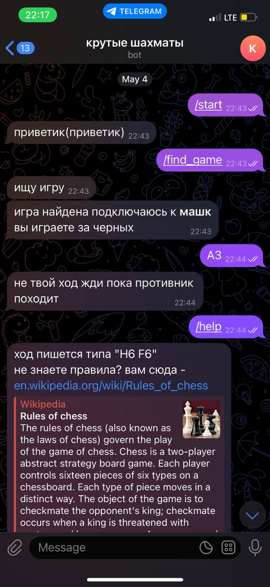
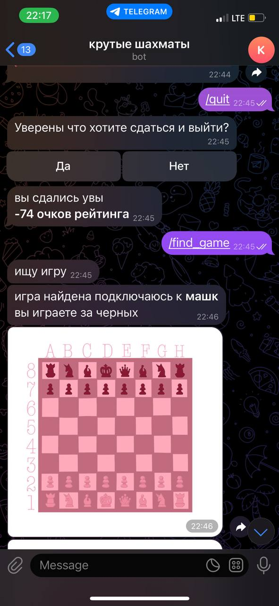
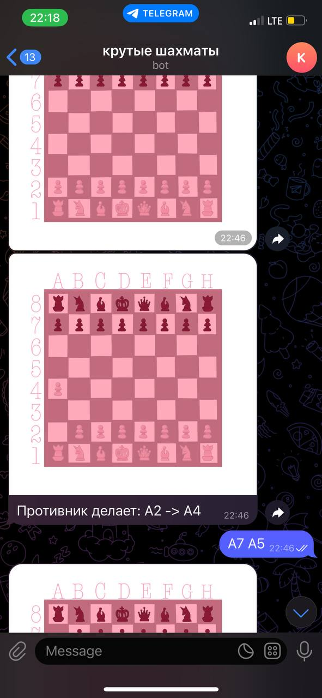
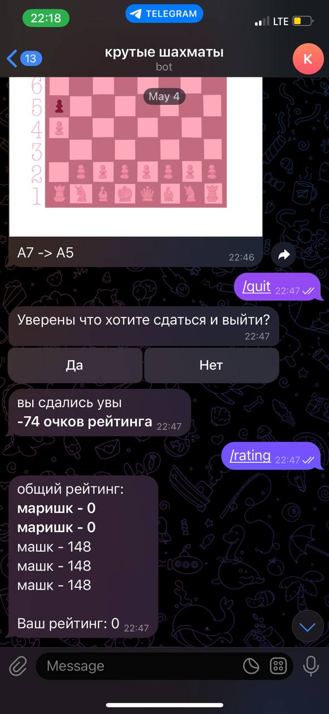

# Проектная (учебная) практика
# Вариативная часть задания
## Введение

Документация описывает процесс реализации технологии для вариативной части задания.

- **Формат реализации технологии** Написание телеграмм бота для игры в шахматы на Python
- **Репозиторий:** [Папка variable_task](https://github.com/mariiiiiinad/Practice/tree/main/variable_task)
- **Стек технологий:** язык Python, также технологии pyTelegramBotAPI, Pillow


# Шахматный Telegram-бот

Полнофункциональный шахматный бот для Telegram с визуализацией доски, системой рейтинга и поддержкой многопользовательской игры.

## Возможности

- Полная реализация правил шахмат (шах, мат, рокировка, взятие на проходе, превращение пешки)
- Визуализация доски с изображениями фигур
- Система рейтинга игроков
- Система поиска соперников
- Пошаговая игра
- Сохранение состояния игры


2. Требования
Инструменты разработки: PyCharm
Библиотеки: python-telegram-bot, sqlite3

## Окружение и структура проекта 
## Основные файлы проекта

### `config.py`
- Содержит конфигурационные данные бота
- Хранит токен для доступа к Telegram API

### `main.py`
- Главный исполняемый файл бота
- Обрабатывает команды и сообщения пользователей
- Управляет игровыми сессиями
- Координирует работу всех модулей

### `chess.py`
- Реализует логику шахмат
- Содержит классы:
  - `Board` - игровая доска
  - `Piece` и его наследники для всех типов фигур
- Проверяет корректность ходов
- Определяет шах/мат

### `db_parser.py`
- Работает с базами данных SQLite
- Основные функции:
  - Управление очередью игроков
  - Сохранение состояния игр
  - Обновление рейтингов

### `image_board.py`
- Генерирует изображения доски
- Использует библиотеку Pillow
- Накладывает фигуры на доску
- Сохраняет результат в PNG

## Директории проекта

### `data/`
Содержит графические ресурсы:

- `board.png` - изображение пустой доски
- `pawn_w.png`, `pawn_b.png` - пешки
- `knight_w.png`, `knight_b.png` - кони
- `bishop_w.png`, `bishop_b.png` - слоны
- `rook_w.png`, `rook_b.png` - ладьи
- `queen_w.png`, `queen_b.png` - ферзи
- `king_w.png`, `king_b.png` - короли

### `dbs/`
Хранит базы данных SQLite:

1. `boards.sqlite` - активные игры
   - Состояние доски
   - Чей сейчас ход
   - ID игроков

2. `queue.sqlite` - очередь игроков
   - ID ожидающих соперника

3. `stats.sqlite` - статистика
   - Рейтинги игроков
   - История игр


## Как это работает

### Начало игры
1. Игрок отправляет `/start`
2. Команда `/find_game` ищет соперника
3. При нахождении соперника начинается игра с случайным выбором цвета

### Выполнение ходов
- Ходы отправляются в алгебраической нотации (например, "E2 E4")
- Бот проверяет корректность хода по правилам шахмат
- Оба игрока получают изображение обновлённой доски после каждого хода

### Особые ходы
- **Рокировка**: Определяется автоматически при ходе короля на две клетки
- **Превращение пешки**: Бот предлагает выбор фигуры при достижении пешкой последней горизонтали
- **Взятие на проходе**: Обрабатывается автоматически

### Окончание игры
- Автоматическое определение мата/пата
- Возможность сдаться командой `/quit`
- Изменение рейтинга по результатам игры

## Базы данных

Три SQLite базы данных для управления состоянием:

1. **stats.sqlite** - Рейтинги игроков
   ```sql
   CREATE TABLE stats (user_id INTEGER PRIMARY KEY, rating INTEGER DEFAULT 1000)
   ```
2. **queue.sqlite** - Очередь игроков
   ```sql
   CREATE TABLE queue (user_id INTEGER PRIMARY KEY)
   ```
3. **boards.sqlite** - Текущие игры
   ```sql
   CREATE TABLE boards (user_id TEXT PRIMARY KEY, board TEXT, move INTEGER)
   ```

### Предварительные требования
- Python 3.8 или новее
- Учетная запись Telegram
- Токен бота от @BotFather

### 1. Клонирование репозитория
```bash
git clone https://github.com/mariiiiiinad/chess-telegram-bot.git
cd chess-telegram-bot
```

### 2. Основные зависимости

Установите необходимые пакеты через pip:

```bash
pip install -r requirements.txt
```
### 3. Настройка конфигурации

### 1) Получение токена бота
1. Откройте Telegram и найдите @BotFather
2. Отправьте команду `/newbot`
3. Следуйте инструкциям для создания нового бота
4. Скопируйте полученный токен 

### 2) Создание конфигурационного файла

Создайте файл `config.py` в корне проекта со следующим содержимым:

```python
# Основной токен бота
BOT_TOKEN = 'ВАШ_ТОКЕН_ЗДЕСЬ'
```

# Дополнительные настройки (опционально)
DEBUG_MODE = False  # Режим отладки
ADMIN_IDS = [12345678]  # ID администраторов
MAX_GAMES = 100  # Максимальное количество одновременных игр

## Примеры использования





### 1. Начало работы с ботом
```text
Пользователь: /start
Бот: "приветик(приветик)"
(показывает клавиатуру с командами: /find_game, /rating, /help, /bye)
```

### 2. Поиск игры
```text
Пользователь: /find_game
Бот: "ищу игру"
(при нахождении соперника)
Бот: "игра найдена подключаюсь к *ИмяСоперника*"
"вы играете за белых"
(отправляет изображение доски)
```

### 3. Выполнение хода
```text
Пользователь: H6 F6
Бот проверяет ход и:
- Если ход корректный:
  Отправляет обновленное изображение доски с подписью "H6 -> F6"
  Соперник получает: "Противник делает: H6 -> F6"
- Если ход некорректен:
  Бот: "не твой ход жди пока противник походит"
  или "ход /help для хелп"
```

### 4. Специальные ситуации
```text
Бот добавляет к сообщению: "шах белых" или "шах черных"
Бот: "На какую фигуру вы хотите поменять пешку?"
(показывает инлайн-клавиатуру с вариантами:
- Конь
- Ладья  
- Слон
- Королева)
Бот: "мат. конгратс.\n*+X очков рейтинга*"
Соперник: "мат. увы.\n*-X очков рейтинга*"
```
### 5. Просмотр рейтинга
```text
Пользователь: /rating
Бот: "общий рейтинг:
*Игрок1 - 1500*
Игрок2 - 1450
...
Ваш рейтинг: 1400"
```
### 6. Выход
```text
Пользователь: /quit
Бот: "Уверены что хотите сдаться и выйти?"
(показывает инлайн-клавиатуру:
- Да
- Нет)
```
### 7. Помощь
```text
Пользователь: /help
Бот: "хелп
/find_game - найти игру
/rating - показать рейтинг ваш и других игроков
/bye - пока"

Во время игры:
Бот: "ход пишется типа 'H6 F6'
не знаете правила? вам сюда - en.wikipedia.org/wiki/Rules_of_chess"
```

